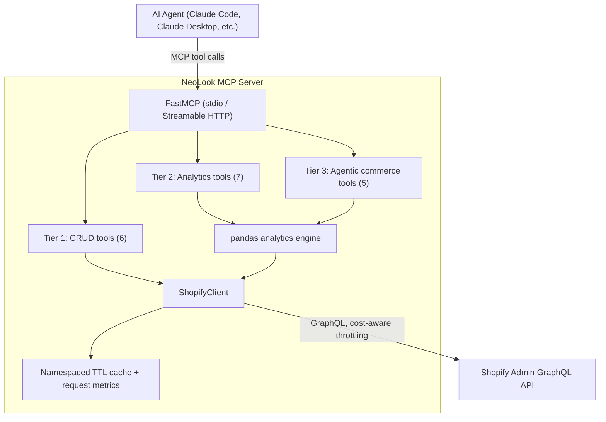

# NeoLook MCP Server

A Python [MCP](https://modelcontextprotocol.io) server for Shopify that goes beyond
CRUD: it adds a server-side analytics engine (pandas over the Admin API) and
agentic commerce tools that execute multi-step workflows autonomously, on top
of a caching layer with real request instrumentation and an eval harness that
measures agent task-success rate against a live dev store.

## Why this exists

Most community Shopify MCP servers expose the Admin API 1:1 - a tool per
resource, a tool per verb. That's useful, but it means every insight ("what's
selling", "who's a repeat customer", "which products are stale") and every
multi-step action ("recover this abandoned cart," "run a flash sale") has to be
orchestrated turn-by-turn by whatever agent is driving it. NeoLook moves that
work server-side instead, so an agent can ask for the answer or the outcome
directly.

| | Typical community Shopify MCP | NeoLook |
|---|---|---|
| Products/orders/discounts CRUD | Yes | Yes |
| Server-side analytics (pandas) | No | Yes - 7 tools |
| Multi-step autonomous workflows | No | Yes - 5 tools |
| Request caching + instrumentation | No | Yes, with measured hit rate |
| Measured agent task-success rate | No | Yes - eval harness against a live store |

## Architecture



## Tool catalog (18 tools, 3 tiers)

### Tier 1 - CRUD

| Tool | Description |
|---|---|
| `search_products` | Search products using Shopify search syntax |
| `update_product` | Update title, status, and/or variant prices |
| `get_order` | Get full details for one order by name or GID |
| `list_orders` | List recent orders, optionally filtered |
| `create_discount` | Create a basic percentage-off discount code |
| `adjust_inventory` | Adjust a variant's stock at a location by a delta |

### Tier 2 - Analytics (pandas, computed server-side)

| Tool | Description |
|---|---|
| `revenue_summary` | Total revenue/orders over a window, optionally by day or product |
| `top_products` | Best-selling products by revenue or units |
| `sales_velocity` | Units/day per product, and trend vs. the prior period |
| `stale_inventory_report` | High-stock, low-recent-sales products |
| `abandoned_checkout_report` | Abandoned checkouts, or open draft orders as a documented fallback |
| `discount_roi` | Per-code orders, revenue, discount given, and ratio |
| `customer_repeat_rate` | One-time vs. repeat customers and repeat revenue share |

### Tier 3 - Agentic commerce (multi-step, action-taking)

| Tool | Description |
|---|---|
| `recover_abandoned_carts` | Finds qualifying carts, creates a discount code, drafts recovery emails (not sent) |
| `create_flash_sale` | Finds stalest products, creates a collection + scoped timed discount |
| `create_checkout_link` | Creates a draft order and returns a real payable invoice URL |
| `price_optimization_suggestions` | Heuristic raise/discount candidates with reasoning (not ML) |
| `get_server_metrics` | Cache hits/misses, requests saved, throttle events |

## Quickstart

```bash
git clone <this-repo>
cd neolook-mcp-server
python3 -m venv .venv
source .venv/bin/activate
pip install -e ".[dev]"

cp .env.example .env   # then fill in your Shopify Dev Dashboard Client ID/Secret

python scripts/ping.py           # verify Shopify auth
python scripts/seed_store.py     # populate a dev store with demo data (optional)
python -m pytest tests/ -v       # run the unit test suite
```

To use it with Claude Code, register it from this project's directory:

```bash
claude mcp add neolook -- .venv/bin/python -m neolook.server
```

Then just ask Claude to do something Shopify-related ("search my products
for 'shirt'", "what's my revenue this month?") - it'll find and call the
right tool. For Claude Desktop, add the same command/args under
`mcpServers` in its config file instead.

By default the server runs over stdio (one process per client - the normal
way to use it). Setting `NEOLOOK_TRANSPORT=streamable-http` (plus
`NEOLOOK_HTTP_PORT`) instead runs it as a standalone long-lived HTTP server
that multiple clients can share - see "Caching design" below for why the
eval harness uses this mode.

## Eval methodology

`evals/run_evals.py` runs each of the 24 tasks in `evals/tasks.yaml` through a
headless Claude Code agent (`claude -p`) with only this server's tools
allowlisted, then verifies the resulting store state directly via GraphQL -
never by trusting the agent's own report of what it did. Between tasks, any
resources the task created (discount codes, collections, draft orders) are
diffed against a before/after snapshot and cleaned up.

To measure the caching claim honestly, the suite runs **twice** - once with
`CACHE_ENABLED=false`, once with `CACHE_ENABLED=true` - and compares the
number of requests actually sent to Shopify in each pass. The server is
launched **once per pass** over streamable-HTTP, and every task in that
pass shares that one warm process - the way a real long-lived deployment
would actually be used - rather than resetting the cache before every
single task.

**These numbers are pasted in from an actual run, not invented** (see
`evals/results/eval_20260704T*.json` and `docs/BUILD_LOG.md` Phases 7-8 for
the full story, including several real bugs the harness itself had that
were found and fixed before trusting these numbers):

| Metric | Result |
|---|---|
| Task success rate | 22/24 (91.7%) |
| Per-category breakdown | discount 3/3 · checkout 3/3 · analytics 9/9 · workflow 7/9 |
| Overall API traffic reduction from caching | 66.0% |
| Read-only traffic reduction from caching | 76.9% |

Read-only reduction is reported separately from overall because
mutations are never cached by design (they always hit the network and
invalidate the relevant namespace) - blending them into one number would
dilute the caching-specific claim with calls that were never candidates
for caching in the first place.

The two workflow failures are check-design artifacts or one-off agent
nondeterminism, not consistent capability gaps - the exact tasks that
fail vary somewhat between runs, and each one has been manually
re-verified live at least once. See `docs/BUILD_LOG.md` Phases 7-8 for
the full detail on every failure investigated.

## Caching design

Every read query goes through a namespaced TTL cache (`cachetools.TTLCache`,
one cache per resource - products/orders/customers/discounts/inventory/
collections). The cache key is a SHA256 hash of the query text plus its
variables, so identical requests reuse the same entry. Mutations are never
cached and instead clear the relevant namespace(s), so a write is always
immediately reflected in the next read. `ShopifyClient` tracks both
combined (`requests_attempted`/`requests_sent_to_shopify`) and
read/write-specific (`reads_*`/`writes_*`) counters, plus `cache_hits`, so
the traffic-reduction claim is measured, not asserted.

## Rate-limit design

Shopify's GraphQL Admin API is cost-based: each response includes
`extensions.cost.throttleStatus` (`currentlyAvailable`, `restoreRate`,
`maximumAvailable`). `ShopifyClient` reads this after every call and, if the
available budget is running low, proactively sleeps `(requested - available)
/ restoreRate` seconds before the next call. If Shopify still returns a
`THROTTLED` error, or the request hits a transient network timeout or 5xx, it
retries up to 3 times with exponential backoff.

## Known limitations (documented honestly, not hidden)

- Shopify only exposes the last 60 days of orders by default; this project's
  Dev Dashboard app requests the `read_all_orders` scope for the full
  120-day analytics window.
- `abandoned_checkout_report` and `recover_abandoned_carts` can only surface
  *real* abandoned checkouts, which requires an actual customer leaving
  checkout mid-flow - there's no API to fabricate one for demo purposes. Both
  tools fall back to open/incomplete draft orders as a documented stand-in
  signal when no real abandoned checkouts exist (the normal case on a fresh
  dev store).
- Seeded demo orders are all stamped with Shopify's real creation time (today
  - there's no API to backdate an order), so `scripts/seed_store.py` writes
  each order's *intended* historical date to `seed_manifest.json`, and the
  analytics engine optionally overlays that simulated date in place of the
  real one. This is a clearly-labeled demo simulation, not a claim that
  Shopify backdated anything - see `docs/BUILD_LOG.md` Phase 5 for the full
  story.

## Roadmap

- **LTV / RFM customer segmentation** (`feature/ltv-rfm` branch, in
  development): working RFM segmentation (Champions/Loyal/At-Risk/
  Hibernating/New), plus a v1 naive LTV estimate. A probabilistic LTV model
  (BG/NBD + Gamma-Gamma) is scoped but not yet built - see
  `docs/LTV_ROADMAP.md` on that branch.
- Churn prediction.
- Multi-touch attribution for marketing spend.
